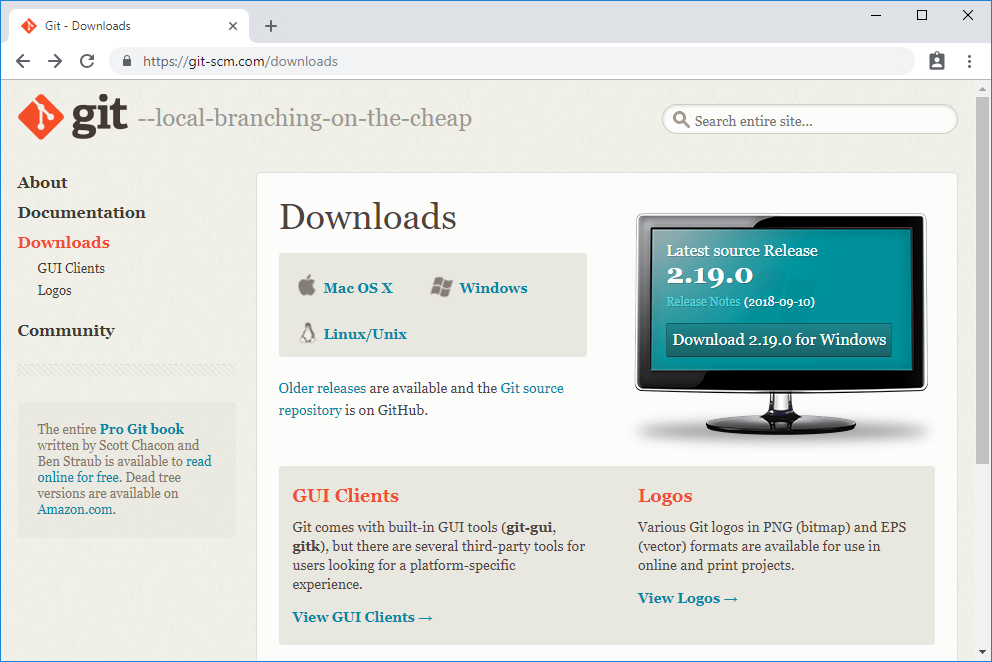
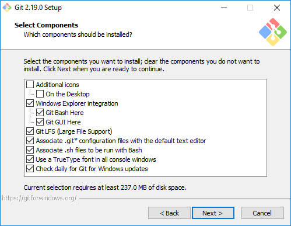
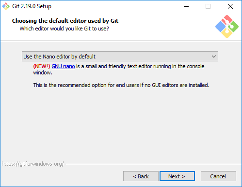
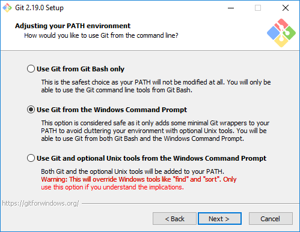

# Installation and Setup

## Installation

To get up and running you need to install the Git client software. It is available for Windows, Linux and Mac and are found at https://git-scm.com/downloads.

1. Download and execute the installer.  
    
1. Accept defaults when asked what components to install.  
    
1. Leave **Nano** as the default editor.   
    
1. To be able to use Git in the windows command prompt go with the second option (default), when asked to adjust you PATH environment.  
    
1. Use the OpenSSL library for HTTPS.  
    
1. Checkout Windows-style.  
    
1. Accept the defaults for the remaining of the installation wizard.

## Verify Your installation

When the installation is done, you should be able to find some Git related programs in the start menu.


Git is a command line tool, and what we have installed is a windows command prompt shortcut, a bash terminal emulater and a simple GUI frontend. For this tutorial we will primarily be using Git Bash, but if you really like the windows command prompt, you will find yourself better at home using Git CMD or Windows PowerShell.

Open Git Bash and type:
```bash
$ git --version
```

if git returns a version number, git is installed and you are all set.

```bash
git version 2.10.2.windows.1
```

## Configuring your identity

Git needs to know *you* in order to be able to insert meta data in commits. We can configure that (among many other things) with the `git config` command. 

To tell git you name and email run the commands below – **and please substitute the email with your student email and the name with your own name**.

```bash
$ git config --global user.name "Firstname Lastname"

$ git config --global user.email "email@example.com"
```
